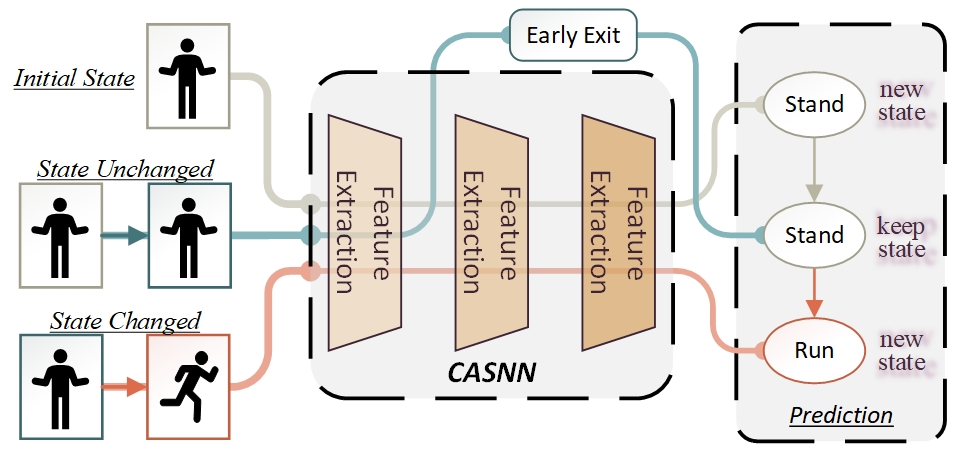

# CASNN: Continuous Adaptive Spiking Neural Network

## Abstract

Human Activity Recognition (HAR) utilizing Inertial Measurement Units (IMU) on wearable devices as the primary source of time-series data, is an application of great importance in the Internet of Things (IoT). Continuous monitoring and recognition of user activities throughout the day is not only a key component of smart healthcare applications, but also serves as a complement to other applications. However, performing continuous activity recognition tasks on resource-constrained wearable devices, particularly those utilizing neural network-based recognition, poses significant challenges. This study focuses on addressing the energy consumption and performance issues for continuous activity recognition tasks based on time-series signals on low-power wearable devices. Initially, we present the continuous dataset that more accurately mirrors real-world usage scenarios, serving as a benchmark to inform the design of the Continuous Adaptive Spiking Neural Network (CASNN). The proposed CASNN is implemented by integrating early exit mechanism into SNN, which is achieved without the need for early exit branches and additional classifiers. Experiments conducted on a wearable device performance evaluation platform show that the proposed CASNN, in comparison to SNN of equivalent size, achieves an average reduction of 60\% in Floating Point Operations (FLOPs), 54\% in inference time, and a 3\% improvement in accuracy on UCI-HAR and HHAR datasets.



## pytorch

Model training and infrencing by PyTorch, including the custom operator lif.

Training set excludes one particular subject (id=x) dataset, and is shuffled.

Test set consists of one particular subject dataset, and is not shuffled, batchsize set 128 to meet the model name, but actual batchsize is 1.

### TABLE II. UCI-HAR

```bash

pythonmain.py--datasetucihar--modeldirucihar_lod--backboneFCN--lr1e-4--batch_size128--casessubject_large--target_domain1,8,15--eval

pythonmain.py--datasetucihar--modeldirucihar_lod--backboneSFCN--lr1e-4--batch_size128--tau0.75--thresh0.5--casessubject_large--target_domain1,8,15--eval

pythonmain.py--datasetucihar--modeldirucihar_lod--backboneCASNN--lr1e-4--batch_size128--tau0.75--thresh0.5--casessubject_large--target_domain1,8,15--eval--tee27016096

```

### TABLE III. HHAR

```bash

pythonmain.py--datasethhar--modeldirhhar_lod--backboneFCN--lr1e-3--batch_size128--casessubject--target_domaina,b,c--eval

pythonmain.py--datasethhar--modeldirhhar_lod--backboneSFCN--lr1e-3--batch_size128--tau0.75--thresh0.5--casessubject--target_domaina,b,c--eval

pythonmain.py--datasethhar--modeldirhhar_lod--backboneCASNN--lr1e-3--batch_size128--tau0.75--thresh0.5--casessubject--target_domaina,b,c--eval--tee27016096

```

### Early exit threshold Scanning

1. In the function *tee_scan()* in the main.py, you can change the scope of the threshold scanning and the specified Lif layers. It contains single layer, grid, coarse scan modes.
2. Adding additional option *eescan* under eval mode, example:

   ```bash

   python main.py --dataset ucihar --modeldir ucihar_lod --backbone CASNN --batch_size 128 --tau 0.75 --thresh 0.5 --eval --eescan --cases subject_large --target_domain 1

   ```

3.*eescanlog/scanview.ipynb* shows the visulization example of the scanning logs, providing the way to pick the appropriate early exit thresholds.

### Export to Deployment

1. Model: Use toonnx.py with same bash cmd to export corresponding onnx model.
2. Test dataset: Use ./tools/export_testloader.py with same bash cmd to export corresponding test dataset.

## onnxDeploy

Please build based on the latest version of [OnnxRuntime](git@github.com:microsoft/onnxruntime.git) and adjust the corresponding directory according to the instructions in CMakeLists.

If you want to run it on arm linux embedded devices, please build based on this repo: [https://github.com/FZR95/onnxruntime.git](https://github.com/FZR95/onnxruntime.git) . We have completed deployments on Zynq 7020 (Xilinx), MPSOC (Xilinx), Arm A35 (ROCKPI) based on this library.

## Acknowledgement

This code framework is based on the work [Tian0426/CL_HAR](https://github.com/Tian0426/CL-HAR) and [Intelligent-Computing-Lab-Yale/SNN_HAR](https://github.com/Intelligent-Computing-Lab-Yale/SNN_HAR). Many thanks to them for making such a valuable resource available to our project.
